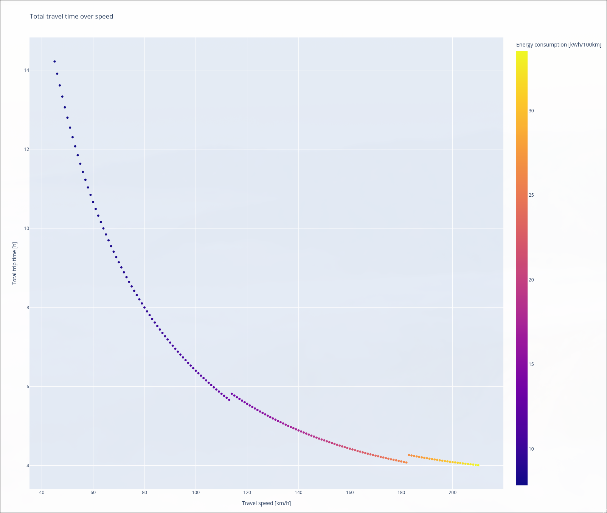

# How fast should I go?

This utility calculates the total travel time over speed for BEVs.

Example:


## How to run
```
sudo pacman -S uv git
git clone https://github.com/dreisicht/bev_thinkings
cd bev_thinkings
uv run src/main.py
```
